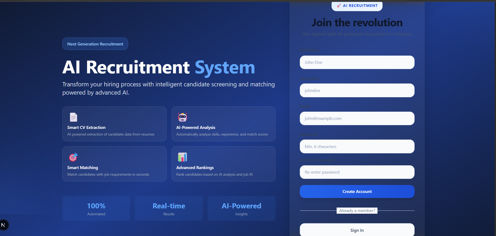
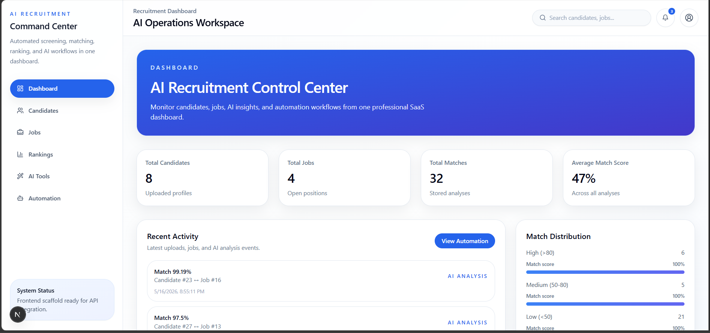
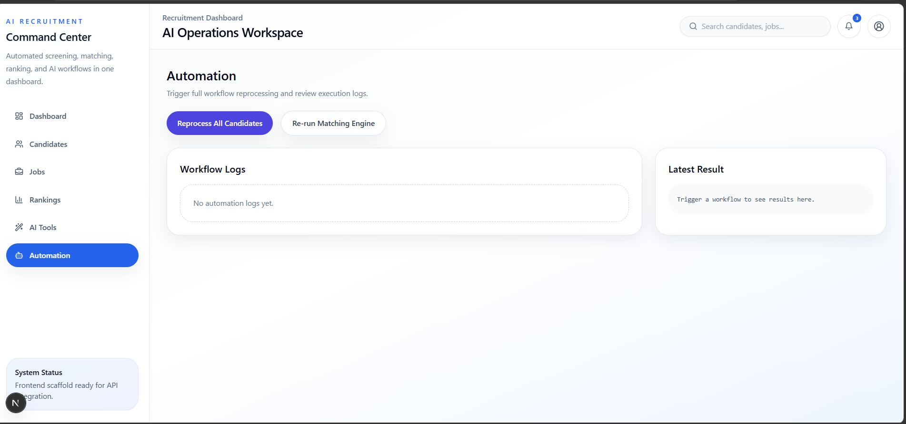

# AI Recruitment Screening System

An AI-powered recruitment screening platform that automates CV parsing, candidate-job matching, ranking, and interview question generation. Built with Django REST Framework, Next.js, and integrated with **Groq AI** (primary) and **Google Gemini** (fallback) for intelligent hybrid scoring.

## Screenshots

### Authentication

| Sign In | Sign Up |
|---------|---------|
|  |  |

### Dashboard & Candidates

| Dashboard | Candidates List |
|-----------|----------------|
|  |  |

| Candidate Detail |
|-------------------|
|  |

### Jobs & Rankings

| Jobs List | Job Detail |
|-----------|------------|
|  |  |

| Rankings |
|----------|
|  |

### AI Features

| AI Tools | Automation |
|----------|------------|
|  |  |

## Key Features

- **Token-Based Authentication** - Sign up, sign in, sign out with DRF Token Authentication
- **CV Parsing** - Upload PDF/DOCX resumes with automatic text extraction (PyPDF2, python-docx, spaCy NLP)
- **Hybrid AI Matching** - Deterministic skill matching + LLM-powered scoring (75% local + 25% AI)
- **Dual AI Providers** - Groq AI (primary, `llama-3.3-70b-versatile`) with Google Gemini fallback
- **Candidate Ranking** - Weighted scoring across skills, experience, and education
- **AI Interview Questions** - Auto-generated interview questions based on job-candidate match
- **AI Match Explanations** - Natural language summaries of why a candidate fits a role
- **Job Parsing** - AI-powered extraction of skills, role type, and experience level from job descriptions
- **Event-Driven Automation** - Agent orchestrator with event bus for automatic processing pipelines
- **Bulk CV Upload** - Upload multiple CVs at once for batch processing
- **Modern Dashboard** - Next.js frontend with global search, notifications, and responsive design

## Tech Stack

### Backend

| Technology | Purpose |
|------------|---------|
| Python 3.12+ | Runtime |
| Django 5.2 | Web framework |
| Django REST Framework | API layer |
| PostgreSQL | Database |
| spaCy | NLP / entity extraction |
| Groq AI | Primary LLM provider |
| Google Gemini | Fallback LLM provider |
| python-decouple | Environment config |

### Frontend

| Technology | Purpose |
|------------|---------|
| Next.js 15 | React framework |
| TypeScript | Type safety |
| Tailwind CSS | Styling |
| Axios | HTTP client |
| React Query | Data fetching |
| Lucide Icons | UI icons |

## Architecture

```
Client (Next.js)  -->  Django REST API  -->  PostgreSQL
                            |
                     AI Router (Hybrid)
                      /            \
               Groq AI           Gemini AI
          (Primary LLM)       (Fallback LLM)
                            |
                    Event Bus / Orchestrator
                   /        |         \
           Job Agent  Candidate Agent  Ranking Agent
```

### Hybrid Scoring Formula

```
Final Score = (Deterministic Score x 75%) + (LLM Score x 25%)
```

- **Deterministic**: Skill matching, experience comparison, education check
- **LLM**: Semantic analysis via Groq/Gemini for nuanced scoring
- **Fallback**: Local heuristics if both AI providers fail

## Installation

### Prerequisites

- Python 3.12+
- PostgreSQL
- Node.js 18+

### 1. Clone and set up the backend

```powershell
git clone https://github.com/NomanWahdat/ai_recruitment_system.git
cd ai_recruitment_system

python -m venv .venv
.\.venv\Scripts\Activate.ps1
pip install -r requirements.txt
python -m spacy download en_core_web_sm
```

### 2. Create environment file

```powershell
Copy-Item .env.example .env
```

Edit `.env` with your values:

```env
SECRET_KEY=your-secret-key-here
DEBUG=True
ALLOWED_HOSTS=localhost,127.0.0.1

DB_NAME=ai_recruitment_system
DB_USER=postgres
DB_PASSWORD=your_postgres_password
DB_HOST=localhost
DB_PORT=5432

CORS_ALLOWED_ORIGINS=http://localhost:3000,http://127.0.0.1:3000

# AI Providers
GROQ_API_KEY=your_groq_api_key
GROQ_API_URL=https://api.groq.com/openai/v1
GROQ_MODEL=llama-3.3-70b-versatile

GEMINI_API_KEY=your_gemini_api_key
GEMINI_API_URL=https://generativelanguage.googleapis.com/v1beta/models/gemini-pro:generateContent
GEMINI_MODEL=gemini-pro

# Feature Flags
USE_GROQ_AI=true
USE_GEMINI_FALLBACK=true
USE_LLM_FOR_SCORING=true

# Hybrid Scoring Weights
SKILL_WEIGHT=0.5
EXPERIENCE_WEIGHT=0.3
EDUCATION_WEIGHT=0.2
LLM_SCORE_WEIGHT=0.25
```

### 3. PostgreSQL setup

```sql
CREATE DATABASE ai_recruitment_system;
```

### 4. Run migrations and start backend

```powershell
python manage.py makemigrations
python manage.py migrate
python manage.py createsuperuser
python manage.py runserver
```

### 5. Set up and start frontend

```powershell
cd frontend
npm install
npm run dev
```

### 6. Access the application

- **Frontend**: http://localhost:3000
- **Backend API**: http://127.0.0.1:8000/api/
- **Admin Panel**: http://127.0.0.1:8000/admin/

## API Endpoints

### Authentication

| Method | Endpoint | Description |
|--------|----------|-------------|
| POST | `/api/auth/register/` | Register a new user |
| POST | `/api/auth/login/` | Login and get token |
| POST | `/api/auth/logout/` | Logout and delete token |
| GET | `/api/auth/me/` | Get current user info |

### Jobs

| Method | Endpoint | Description |
|--------|----------|-------------|
| GET | `/api/jobs/` | List all jobs |
| POST | `/api/jobs/` | Create a job |
| GET | `/api/jobs/{id}/` | Get job details |
| PUT | `/api/jobs/{id}/` | Update a job |
| DELETE | `/api/jobs/{id}/` | Delete a job |
| GET | `/api/jobs/{id}/rankings/` | Get ranked candidates for a job |

### Candidates

| Method | Endpoint | Description |
|--------|----------|-------------|
| GET | `/api/candidates/` | List all candidates |
| POST | `/api/candidates/` | Create candidate (with CV upload) |
| GET | `/api/candidates/{id}/` | Get candidate details |
| PUT | `/api/candidates/{id}/` | Update candidate |
| DELETE | `/api/candidates/{id}/` | Delete candidate |
| POST | `/api/candidates/bulk-upload/` | Bulk upload CVs |

### AI-Powered Endpoints

| Method | Endpoint | Description |
|--------|----------|-------------|
| POST | `/api/ai/parse-job/` | AI-powered job description parsing |
| POST | `/api/ai/match-explain/` | AI match explanation |
| POST | `/api/ai/interview-questions/` | AI interview question generation |

### Analyses

| Method | Endpoint | Description |
|--------|----------|-------------|
| GET | `/api/analyses/` | List all analyses |
| POST | `/api/analyses/` | Create analysis |
| GET | `/api/analyses/{id}/` | Get analysis details |

### System

| Method | Endpoint | Description |
|--------|----------|-------------|
| GET | `/api/health/` | Health check |

## Testing

Run all backend tests:

```powershell
python manage.py test --settings=config.settings.test
```

Tests cover:
- **Model tests** - Job, Candidate model creation and validation
- **Auth tests** - Registration, login, logout, token management
- **API tests** - CRUD operations for jobs, candidates, rankings

## Project Structure

```
ai_recruitment_system/
├── config/                    # Django settings and URL config
│   ├── settings/
│   │   ├── base.py            # Shared settings
│   │   ├── development.py     # Dev settings (DEBUG=True)
│   │   ├── production.py      # Production settings
│   │   └── test.py            # Test settings (no AI calls)
│   └── urls.py
├── apps/recruitment/          # Main application
│   ├── services/
│   │   ├── ai/                # AI providers (Groq, Gemini, Router)
│   │   ├── automation/        # Event bus, orchestrator, agents
│   │   ├── matching/          # Hybrid matcher, scorer, skill matcher
│   │   └── candidate_processor.py
│   ├── tests/                 # Test suite
│   ├── auth_views.py          # Authentication API views
│   ├── models.py              # Job, Candidate, Analysis models
│   ├── serializers.py         # DRF serializers
│   └── views.py               # API views
├── frontend/                  # Next.js application
│   ├── app/                   # Pages and layouts
│   ├── components/            # UI components
│   │   ├── auth/              # Sign in/up forms
│   │   └── layout/            # Sidebar, Topbar, AuthGate
│   ├── contexts/              # AuthContext
│   ├── services/              # API service layer
│   └── lib/                   # Axios config
├── media/demo/                # Demo screenshots
└── requirements.txt
```

## License

This project is for educational and portfolio purposes.

---

**Built by [Noman Wahdat](https://github.com/NomanWahdat)**

